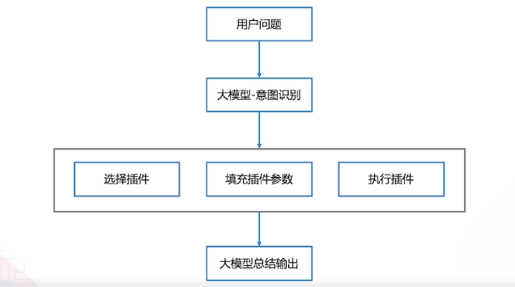

# 插件

* 传统插件：浏览器插件、wps插件、客户端插件

遵循一定规范的应用程序接口编写的程序。

* 大模型插件：gpt插件、灵境

核心是web api, 独立于大模型、不受大模型约束、没有开发语言限制。

# 灵境

灵境是一个平台，用来制作文心一言的插件。

文心一言是一个智能中枢大脑，插件就是文心一言的耳、目、手。插件将文心一言的AI能力和外部应用相结合，丰富大模型的落地场景，同时利用大模型完成此前无法实现的任务。

给文心一言提供 信息增强、交互增强、服务增强。

* 信息增强：利用搜索提供实时信息
* 交互增强：理解PDF、图片、文档等
* 服务增强：订机票、定闹钟、发邮件、管理日程

## 科普和建议

所谓的深度学习，简单说就是：无数次排序纠正对错训练的结果。

- 训练过程中还包含一些正则化策略（如dropout、权重衰减等）来防止过拟合
- 涉及到更复杂的技巧，如批量归一化、残差连接、学习率调度等

使用上：**以合作的心态使用大模型：“看看大模型能不能帮到我”。而不是：“让我看看你大模型到底有多NB？”**
  
开发上：**转换思维逻辑，要以人类的思考、交互方式去理解大模型的运用**

GPT和人脑都属于神经计算而不是形式逻辑，而传统计算机程序属于形式逻辑。所以GPT和人一样不擅长形式逻辑计算

那么GPT最好用的时机就是我们调用起它的思维链之后，最好给他足够多的上下文，如果没有足够多的上下文，就简单的让他「先思考，再回答」，让大模型自己唤起自己的思维链

**拟合**

在统计学和机器学习中，拟合（Fitting）是指建立一个模型，使得这个模型能尽可能地描述或预测数据的过程

> "拟合"这个词强调的是模型与训练数据的一致性，即模型能够准确描述或预测训练数据中的模式或趋势。
> 一个模型只有在新的、未见过的数据上也能有良好表现，才能被认为是一个好的模型。这就需要我们关注模型的泛化（Generalization）能力，即模型对未见过的数据的预测能力。

**过拟合**

当一个模型过于复杂，它可以在训练数据上取得很高的精度，但在新的、未曾见过的数据上表现糟糕，这就是过拟合

**欠拟合**

模型过于简单，不能很好地抓住数据中的规律

**向量化**

把原始数据转化为我们可以使用代数和几何的计算方法来处理和分析的数据

## 插件分类

* 数据，提供给用户在使用时的数据集。
* 能力，提供给用户在使用时的能力。
* 应用，提供给用户一套完整的应用流程。

## 插件工作原理

插件的触发机制为：用户主动选择使用(@xxx) 和 百度触发模块调用。

* 开发者提交注册插件
* 百度处理用户query, 通过插件触发模块调用不同的插件
* 根据开发者api描述文件，判断调用哪个api
* 根据用户的query, 调用api
* 大模型润色后（是否润色可在配置文件中设置）反馈用户

例：天气插件选择 -> 询问今天北京的天气 -> 大模型提取关键信息：时间 + 地点 -> 根据协议调用插件API -> 大模型对结果润色反馈用户

## 数据插件

创建并上传数据集即可制作插件

用户上传数据集，并设置数据规则时候，百度会通过对数据集进行向量化来使数据能够被模型理解，并应用于创建的数据插件中

拥有优质数据又不想付出开发成本的话，数据插件是最优选择，且百度承诺数据集仅用来帮助开发者自动化的理解、提炼、总结、调用

> 例如：历史数据查询。

**数据集仅做索引，不做训练，请注意自己需求** 

**一旦选择关联数据集的应用，提交审核后，则不能编辑或修改当前数据集，不能更新！**

### 数据插件调优

* 插件简介写的好，调度器才能发现插件

* 描述信息，清晰、明白、准确的告知插件，使用数据集处理query

> 例如：百家姓插件的简介和描述信息：当用户询问某个姓氏在百家姓排第几位时，根据数据集排序告知用户，简介插件不会让用户看到。

> 简介和信息可以不一样，需要不断地尝试修改，直到效果最好

* 数据集中的内容越**清晰、明白、准确**越好

* 示例中的提示词需要明确当前场景的插件思考（执行）过程。**(数据集插件中，示例调优不太好用，主要还是靠简介和信息)**

> 例如：这是一个查询姓氏排名的query，你需要识别出用户想要查询的姓氏，然后在数据集中查找该姓氏的排名。

### 数据集创建

* pdf文件中不要使用扫描件，目前不能识别

* 分段的目的是将长文拆分成较小的段落，以便模型更好的处理与理解，对模型生成结果有帮助

> 段落重叠字符： 如果**上下文有关联**才设置这个字段否则可以为0，帮助模型理解

> 为保证完整性：虽然设置了最大段落字符数，也会在下一个或前一个分隔符结束

### 未来规划

* 支持API
* 支持大数据集，目前只支持10M * 10个

## 能力插件

上传下述配置文件即可制作插件：

* 插件清单文件（ai-plugin.json，必选），该文件包含插件的基础信息（名称、头像等）、身份验证信息以及OpenAPI 规范等；
* 插件服务描述文件（openapi.yaml，必选），该文件用于模型识别您提供的功能服务；
* 示例描述文件（example.yaml，可选），可在此文件中提供插件示例，以提升插件调用的正确率；
* 动作消息注册文件（msg_content.yaml，可选），该文件用于在用户场景中**展示插件调用进展**；

不支持本地域名调试

**超时限制**

插件服务有超时要求：0.5s 连接超时，3s 读超时，2s 读响应头超时。

官方提供的解决方案为, 使用SSE流式方式返回。（尚未测试）

**SSE**

[SSE](https://developer.mozilla.org/zh-CN/docs/Web/API/Server-sent_events/Using_server-sent_events)，一种基于HTTP的实时通信协议。

SSE是单向的，可以实现服务器向客户端推送数据，而无需客户端不断地向服务器发送请求。这种推送模式可以提高应用程序的性能和响应速度，减少不必要的网络流量

SSE如果不使用HTTP2的话，将会受到最大6个连接数的限制。

### 配置文件注意事项

* `ai-plugin.json` 中 `description_for_model` 字段是对大模型描述插件的能力，要求尽量**简洁、直接、明确**
* `example.yaml` 中提供**三个示例，长度不超过三百个字符**，同时可提供反例：在不需要调用插件的情况下，不进行调用
* `msg_content.yarml` 用来定义异常、消息时的处理机制 - **可提升用户体验**
  * 生成工作进度
  * 处理服务异常
* `prompt` 和配置文件中 `description` 的区别：**prompt是动态的**

### 插件优化

* 清晰、明白、准确的描述插件功能和接口功能
* 添加example，覆盖最典型的示例, 并且添加反例
* 写明接口功能，尽量使用单一职责原则，降低误召率
* 接口中返回 prompt 字段，让大模型利用prompt进行润色
  > 例如：`prompt: "请显示工具返回结果，不要改写任何内容，也不要新增内容。" `, 此时大模型就不会进行润色了

### 更新插件

如您需对插件进行更新操作，需先行下线当前线上版本后，在插件概览 - 编辑插件中提交新版本。

注意：插件的基础信息（头像、名称等）均包含在插件配置文件中，可通过修改 ai-plugin.json 中的对应字段更新基础信息。

## 应用插件

## Q&A

Q: 三种插件模式的区别，以及应用场景

A：

* 数据插件，仅上传数据即可完成插件，开发复杂度0，难点在于数据集中数据的整理方式。场景为：单一的问答场景。
* 能力插件，需要开发相关的接口，配合大模型的润色能力，可以完成一个小产品的整套增删改查。场景为：提供相对完整的一套产品功能。
* 应用插件，

----

Q: 插件的调起方式

A：用户主动@某个插件，或者文心一言的插件触发模块来触发使用某个插件

----

Q: 插件调起逻辑

A: 主要根据开发者的插件描述，是否匹配用户的query，来判断是否调起

----

Q: 传统SEO会被替换么？

A：百度官方目前没有替换的打算。当文心一言被应用在各大入口，大量SEO的有质量产出者，转向插件制作，文心一言可以将会拦截大量的流量。普通SEO的展现量将会严重下降，SEO的价值降低。

----

Q: 平台会把开发者的数据用于文心模型训练吗？

A: 不会，目前模型对数据的调用仅有“索引模式”，也就是不改变模型本身，模型会将开发者上传的数据进行总结提炼，然后给到 C 端用户。具体可参考平台文档：[平台服务协议 ](https://plugin.baidu.com/docs/operations/service_agreement/)运营规则第三项第7条。

> 7. 我们充分尊重和保障您专有的数据安全，我们不会使用开发者通过我们平台提交的数据来训练或改进我们的通用大模型，您提交的数据仅用于帮助您做自动化地理解、提炼、总结与调用。但我们允许开发者选择与我们共享数据来提升优化服务。

----

Q: 插件创建上限是多少个？

A: 50 个。

----

